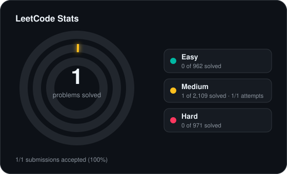
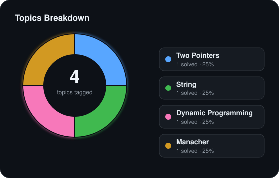

<!-- leetcode-stats:start -->
# LeetCode Solutions

Auto-synced by LeetCode to GitHub Sync.

<!-- leetcode-stats:end -->

| # | Title | Difficulty | Tags | Status |
| --- | --- | --- | --- | --- |
| 5 | [Longest Palindromic Substring](https://leetcode.com/problems/longest-palindromic-substring/) | Medium | Two Pointers, String, Dynamic Programming, Manacher | ✅ Accepted |<!-- id:longest-palindromic-substring -->
| 20 | [Valid Parentheses](https://leetcode.com/problems/valid-parentheses/) | Easy | String, Stack, Bracket Sequences | ✅ Accepted |<!-- id:valid-parentheses -->

